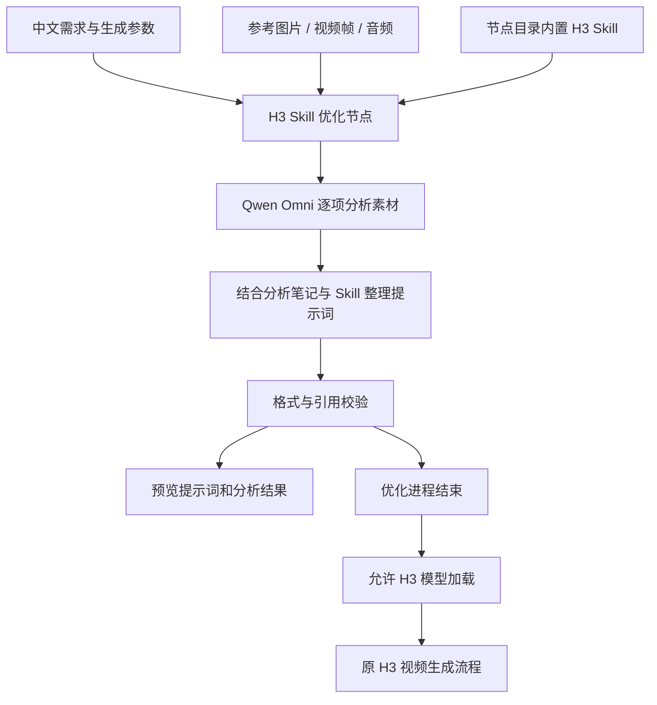

<div align="center">

# ComfyUI H3 Skill Optimizer

### H3 多模态提示词助手

**把你的文字需求、参考图片、视频与音频，整理成 H3 视频生成提示词。**

内置 H3 Skill · 多模态素材分析 · 提示词预览 · 模型顺序加载

[快速开始](#快速开始) · [参数说明](#参数说明) · [RunningHub 部署](#runninghub-部署) · [常见问题](#常见问题)

</div>

---

## 这是什么？

这是一个接入 MiniMax H3 工作流的 ComfyUI 自定义节点包。你可以直接用中文描述需求，同时连接参考素材。插件使用 **Qwen2.5-Omni-7B-AWQ** 分析素材，再结合随节点附带的 H3 Skill 生成结构化提示词，供后续 H3 工作流使用。

例如，你可以输入：

> 参考视频的动作和镜头，用图片中的人物替换主角。音频只参考音色，台词保持参考视频内容。保留原场景，生成约 15 秒的视频。

插件会尝试把人物、动作、场景、音色和台词要求整理为可引用的 H3 描述。**优化结果仍需检查，提示词不能保证生成视频逐帧保持原片。**

## 功能一览

| 功能 | 当前实现 |
|---|---|
| 文字需求 | 接收原始提示词、目标时长、帧数和画面尺寸 |
| 图片参考 | 最多 9 个输入，分析外观、服装、物体、场景等 |
| 视频参考 | 最多 3 个输入，以带时间戳的抽帧序列分析 |
| 音频参考 | 最多 3 个独立音频输入，另支持 3 路视频伴随音频 |
| 内置 Skill | 随节点打包规则文件，默认无需填写 Skill 路径 |
| 引用管理 | 按实际连接的素材生成 Picture、Video、Audio 引用 |
| 结果校验 | 检查段落、引用标签、主体定义和镜头时间格式 |
| 结果预览 | 显示最终提示词、引用映射、素材分析笔记 |
| 推理方式 | 在运行 ComfyUI 的机器上加载模型，无 API Key 字段 |
| 加载顺序 | 优化完成后，再允许工作流中的 H3 重型加载器执行 |

接口数量不代表可以在 24GB 显存下同时满载。实际容量取决于素材、上下文长度和运行环境。

## 工作原理



素材先分别分析，最终整合阶段读取分析笔记。视频采用抽帧分析，音频分块处理；最终整合并非在一次推理中重新读取全部原始媒体。

## 节点说明

| 节点类型 | 界面显示名称 | 用途 |
|---|---|---|
| `H3LocalSkillOptimizer` | H3 · 本地24G Skill优化 | 分析素材并输出优化提示词 |
| `H3LocalPromptPreview` | H3 · 本地优化结果 | 预览提示词和素材分析信息 |
| `H3AfterPrompt` | H3 · 优化完成后加载 | 为后续模型加载建立执行依赖 |

示例工作流使用 **1 个优化节点、1 个预览节点、4 个顺序控制节点**。四个顺序节点不会重复运行大模型。

## 快速开始

### 1. 下载并放置节点

点击仓库右上角 **Code → Download ZIP**，解压后把内部的 `comfyui_h3_local_optimizer` 文件夹复制到 ComfyUI 的 `custom_nodes` 目录。

正确目录结构：

```text
ComfyUI/
└── custom_nodes/
    └── comfyui_h3_local_optimizer/
        ├── __init__.py
        ├── nodes.py
        ├── worker.py
        ├── requirements.txt
        ├── worker-requirements.txt
        ├── skill/
        │   ├── SKILL.md
        │   └── references/
        │       ├── base-en.txt
        │       └── ref-en.txt
        └── web/
            └── preview.js
```

**当前仓库根目录是交付包，节点入口位于内部文件夹。直接把整个仓库克隆到 `custom_nodes` 不等于完成安装。**

### 2. 准备运行环境

安装节点的轻量依赖时，使用启动 ComfyUI 的同一个 Python。以下命令中的 `python` 必须对应那个解释器：

```bash
python -m pip install -r custom_nodes/comfyui_h3_local_optimizer/requirements.txt
```

实际模型推理还需要 Torch、Transformers、AutoAWQ、音频处理等依赖。版本记录见 [worker-requirements.txt](comfyui_h3_local_optimizer/worker-requirements.txt)。

**当前节点使用 ComfyUI 自身的 Python 启动子进程，因此依赖也必须在该环境中可用。** 子进程隔离不等于 Python 依赖隔离；现有 H3 环境是否兼容这些版本需要先验证，不能直接覆盖平台环境的依赖。

### 3. 准备模型

本项目不包含模型权重，也不会在执行优化时自动下载模型。运行环境需提前提供完整的 `Qwen2.5-Omni-7B-AWQ` 模型及处理器文件。

节点界面选择模型名称，无需输入模型地址。当前代码通过 ComfyUI 的 `LLM`、`checkpoints` 路径解析接口查找该名称，随后尝试同名相对目录。**部署端需确保该名称能解析到包含 `config.json` 的完整模型目录；仅出现下拉选项不能证明模型已经安装。**

### 4. 导入并连接工作流

导入 [MiniMax H3 示例工作流](MiniMax-H3-本地24G-Skill优化.json)，检查原工作流依赖的 H3 节点与模型是否齐全。

1. 在原提示词输入处填写需求。
2. 将实际使用的参考图片、视频帧和音频连接到优化节点。
3. 保持 `skill_path` 为空，使用内置规则。
4. 检查时长、帧数和尺寸输入与 H3 生成参数一致。
5. 先用一张图片和一句需求测试，再逐步增加参考素材。
6. 查看预览结果，确认人物、台词、引用和镜头安排后再进行完整视频生成。

只测试优化流程时，可在示例工作流中禁用视频输出节点 214、264，保留预览节点 324；完成检查后恢复视频输出。

## 参数说明

| 参数 | 默认值 | 作用 |
|---|---|---|
| `prompt` | 外部输入 | 用户的原始需求 |
| `duration_seconds` | 15 | 请求的视频时长，单位秒 |
| `target_frames` | 362 | H3 目标帧数；当前时间线按帧数 ÷ 24 计算 |
| `width` / `height` | 544 / 960 | 目标画面尺寸，供提示词整合参考 |
| `model_name` | Qwen2.5-Omni-7B-AWQ | 部署环境提供的模型名称 |
| `skill_path` | 留空 | 使用内置 Skill；填写时覆盖规则目录 |
| `image_side` | 448 | 分析图像的长边上限，不修改 H3 输出分辨率 |
| `video_frames` | 8 | 每路视频分析时的采样帧数 |
| `audio_chunk_seconds` | 6 | 音频分块长度，全部分块都会分析 |
| `max_new_tokens` | 3072 | 最终提示词的输出 token 上限 |
| `timeout_seconds` | 1800 | 优化任务超时限制，单位秒 |
| `refresh` | 0 | 修改数字，触发相同输入重新优化 |

## 内置 Skill 与输出格式

`skill_path` 留空时，节点读取自身 `skill/` 目录中的三个文件：

- `SKILL.md`：H3 提示词规则入口。
- `references/base-en.txt`：无参考素材时的输出规则。
- `references/ref-en.txt`：有参考素材时的输出规则。

有参考素材时，输出包含六个段落：

```text
subject_definitions:
summary:
retention_analysis:
detailed_description:
overall_soundscape:
non_diegetic_music:
```

没有参考素材时，输出三个段落：`integrated_multimodal_description`、`overall_soundscape`、`non_diegetic_music`。描述默认使用英文，台词、歌词与画面文字按原语言保留。

## RunningHub 部署

仓库已提供节点源码和工作流，但**尚未完成 RunningHub 实机验证，也未确认已在平台节点库上架**。

平台需要提供节点安装、兼容的 Python 依赖、完整模型目录、CUDA 和子进程运行能力。上传工作流 JSON 只恢复节点图，不会自动部署这些条件。部署详情见 [RunningHub 安装说明](RunningHub安装说明.md)。

24GB 是本方案的容量目标，尚无真实峰值显存测试。工作流通过先优化、后加载 H3 的顺序降低模型同时占用显存的风险；它不能保证任意素材组合都不超显存。

## 常见问题

### 为什么加载工作流没有报错，运行却失败？

节点显示正常只说明界面能够还原。Python 依赖、模型文件、CUDA 和模型名称解析问题可能在执行时才暴露。需要实际运行优化任务确认。

### 需要 API Key 吗？

提示词优化节点不需要 API Key，推理阶段强制离线。模型和依赖需提前准备。完整工作流中其他节点的行为由各自实现决定。

### Skill 要单独上传吗？

复制完整节点文件夹即可，保留其中的 `skill/` 和 `references/`。正常使用时 `skill_path` 留空。

### 找不到模型怎么办？

让部署方检查所选名称能否解析到完整模型目录，且目录包含 `config.json` 及其余模型、处理器文件。当前错误信息可能仍提到旧字段 `model_path`，界面实际使用的是 `model_name`。

### 为什么有四个“优化完成后加载”节点？

它们分别控制示例中的两个 VAE、一个 CLIP 和一个 UNET 加载器。修改这四个模型文件名时，在顺序节点的 `value` 中修改；不要绕过它们，否则 H3 可能提前占用显存。

### 视频和音频会完整理解吗？

视频只分析采样帧，可能漏掉短暂动作或字幕；音频会分块覆盖，但分块边界、噪声和模型识别能力可能影响台词准确性。请重点检查关键台词、动作与音色要求。

### 输出超长、格式错误或显存不足怎么办？

先减少参考素材数量和需求长度。显存不足可降低图像分析尺寸或视频采样帧数；输出达到 token 上限时可适当提高 `max_new_tokens`。格式或引用校验失败时，检查需求后修改 `refresh` 重新优化。

## 验证状态

| 检查项 | 状态 |
|---|---|
| 素材导出、音频分块、视频时间戳 | 已有离线测试 |
| Skill 汇总、引用映射、AWQ 配置 | 已有离线测试 |
| 子进程离线标志和取消清理 | 已有离线测试 |
| 示例工作流连线与加载依赖 | 已有离线测试 |
| 真实 AWQ 模型加载与推理 | 未实机验证 |
| RunningHub 安装与完整 H3 视频生成 | 未实机验证 |
| 24GB 峰值显存 | 未实测 |

离线测试命令（在仓库根目录执行）：

```bash
python -m unittest discover -s tests -v
```

## 仓库内容

| 文件 / 目录 | 说明 |
|---|---|
| `comfyui_h3_local_optimizer/` | 自定义节点源码、内置 Skill 与前端预览 |
| `MiniMax-H3-本地24G-Skill优化.json` | H3 集成工作流 |
| `RunningHub安装说明.md` | 部署条件与检查步骤 |
| `tests/` | 离线测试 |
| `build_local_workflow.py` | 工作流构建脚本 |

遇到问题可在 [Issues](https://github.com/c920998743-dotcom/comfyui-h3-skill-optimizer/issues) 提交节点报错、运行环境和复现步骤。请勿附上密钥或其他敏感信息。
